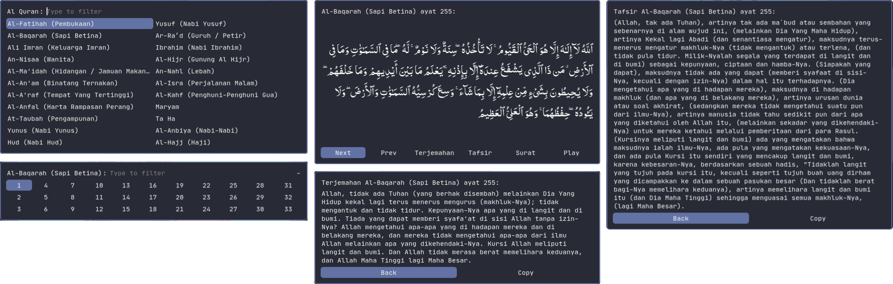

# Al-Quran Rofi
Al-Quran dengan Terjemahan / Tafsir Jalalayn

## Install

### Manual
#### Requirements
- [Rofi](https://github.com/davatorium/rofi)
- [xclip](https://github.com/astrand/xclip)
#### Installasi
- `git clone git@github.com:nesstero/Al-Quran-Rofi.git`
- `pip install -r requirements.txt`
- Jalankan Al-Quran Rofi dengan `python3 Quran.py` atau `python3 <path/dir-dari-quran-rofi>/Quran.py`

### Arch Linux
untuk pengguna distro Archlinux dengan paket manager paru:
```
paru -S quran-rofi
```

### Voidlinux
untuk pengguna distro Voidlinux bisa menggunakan template yang dibuat oleh [Saikyou Ramen](https://facebook.com/saikyouramen/)
- [Template Al-Quran Rofi](https://nekobin.com/zirijeneqe)
- [Template Dynmen](https://nekobin.com/qivopavige)
- [Package Xbps](https://u.pcloud.link/publink/show?code=kZxa0EXZpB9Im0nFFApVTquniQ5AV0hWhyck)

## Configure
untuk pengaturan font Quran dan opsi terjemahan atau tafsir ada di file `~/.config/quran-rofi.ini`

## Preview Al-Quran Rofi

